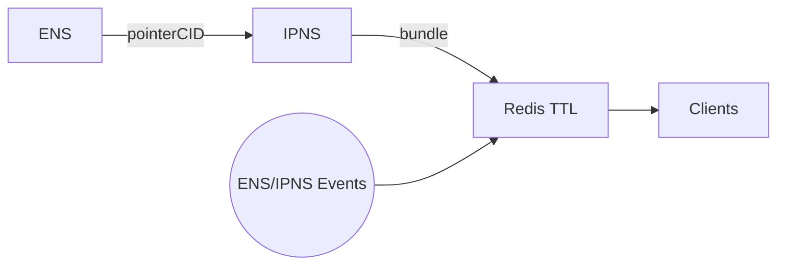
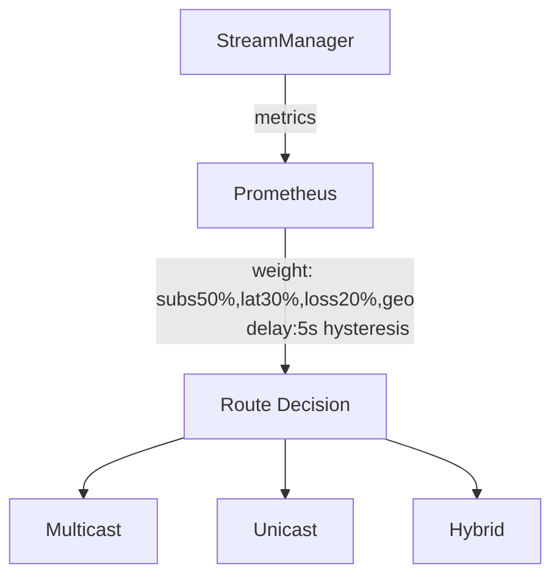
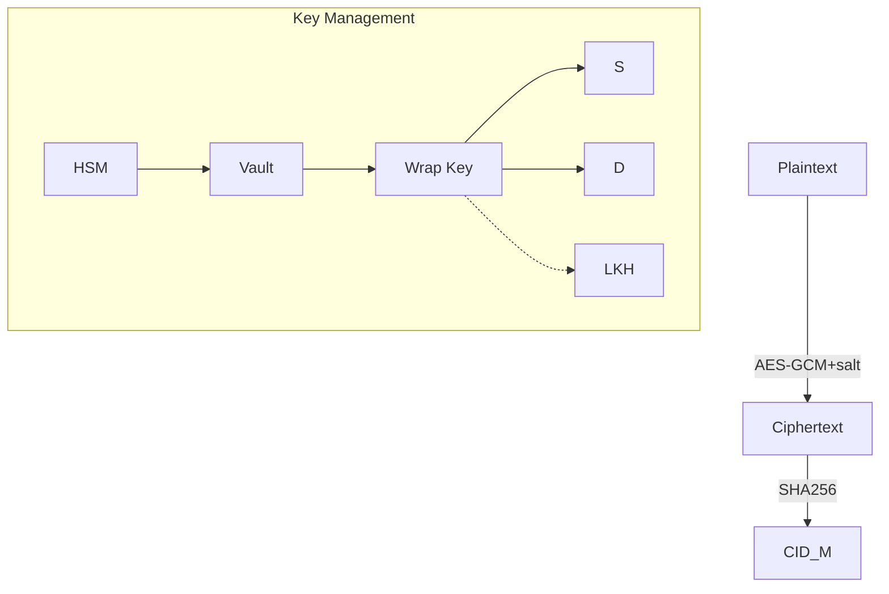
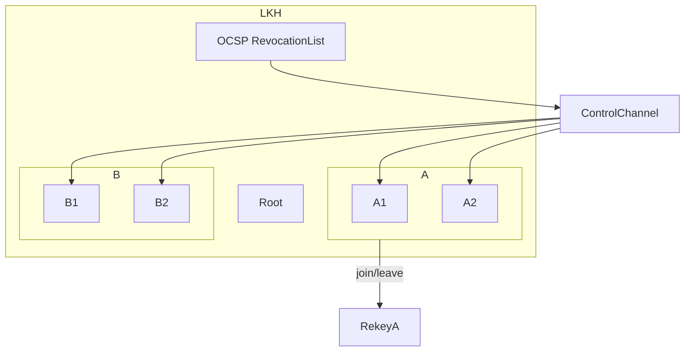
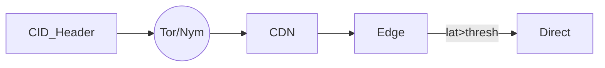
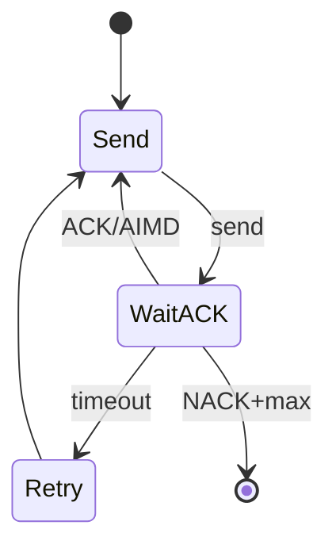
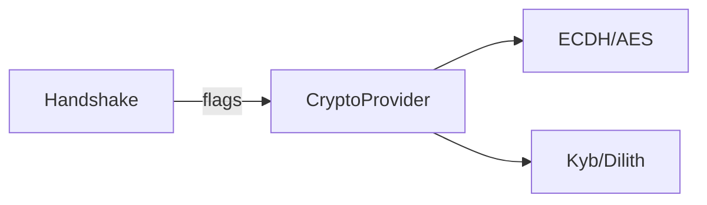

# OmniPlex

## Overview & Purpose

OmniPlex is a decentralized, content‑addressed messaging framework for high‑throughput, low‑latency, and privacy-preserving communications. It uses fixed‑length packets of 256‑bit CIDs + flags, hybrid storage (Redis hot‑tier, IPFS/S3 cold‑tier), dynamic unicast/multicast routing, AES‑GCM encryption with salting, optional mix networks, LKH group keys, and pluggable post‑quantum crypto.

---

## 1. Component Summary

| Section                    | Key Features                                                                                                   | Diagram Ref. |
| -------------------------- | -------------------------------------------------------------------------------------------------------------- | ------------ |
| Protocol & Handshake       | Ephemeral ECDH, packet format (SeqNo, Timeout), fragmentation, CRC/FEC (BLAKE3), key exchange, forward secrecy | Fig. 1       |
| Storage & Promotion        | Redis & IPFS/S3 tiering, ML eviction (online learning), promotion API, optimistic locking via LockManager      | Fig. 2       |
| Mutable Identity Layer     | ENS/IPNS pointers, Redis TTL cache, event-driven invalidation, dynamic TTL                                     | Fig. 3       |
| CDN Orchestration          | Prometheus metrics, weighted routing, 5 s hysteresis, hybrid unicast/multicast, NTP sync                       | Fig. 4       |
| Security & Key Management  | AES‑GCM (+salt/opt‑in unsalted), HSM/Vault, BLAKE3 header, LKH integration, control‑channel auth               | Fig. 5       |
| Group Encryption (LKH)     | Logical key hierarchy, OCSP revocation, RevocationList, O(log n) rekey, WebSocket/QUIC updates                 | Fig. 6       |
| Privacy & Mix Networks     | Tor/Nym gateway toggle, QoS bypass flag, geofencing, dummy padding, policy tiers                               | Fig. 7       |
| Reliability & Flow Control | MQTT‑style QoS, AIMD (init 4, max 64, jitter), sequence numbers, reassembly timeouts, CRC32                    | Fig. 8       |
| Post‑Quantum Transition    | CryptoProvider interface, handshake flags PQ\_Priority/PQ\_Fallback, GPU/FPGA offload                          | Fig. 9       |
| APIs & Error Handling      | `/send`,`/fetch`,`/promote`,`/resolve-identity`,`/route` endpoints; params, error codes, rate limits           | Fig. 10      |
| Monitoring & Telemetry     | `/metrics`, key Prometheus metrics, Grafana dashboards, adaptive ML alerts                                     | —            |
| Security Auditing          | Encrypted CID‑based logs, zk‑SNARK proofs, retention policy, SSS key splitting                                 | —            |
| Test Scenarios             | Locust load tests, Chaos Monkey, mode switching tests, cold-fetch SLA (≤ 500 ms), PQ benchmarks                | —            |
| Compliance & Governance    | GDPR/CCPA erasure, Tombstone CIDs, anonymized logs, meritocratic RFC process                                   | —            |
| Disaster Recovery          | Redis Sentinel multi‑AZ, IPFS pin replication (3×), optimistic locking                                         | —            |

---

## 2. Mermaid Diagrams

### Fig. 1 Protocol Packet & Handshake

```mermaid
sequenceDiagram
    participant S as Sender (CID_S)
    participant R as Resolver
    participant C as CDN
    participant D as Receiver (CID_R)
    S->>C: Handshake [flags=NewSession, PubKeyCID]
    C->>R: Resolve logicalID
    R-->>C: {logicalID, CID_R, TTL, Sig}
    C-->>S: Identity bundle
    S->>D: ECDH key exchange via PubKeyCID
    S->>C: Packet [SeqNo, CID_S, CID_R, CID_M, flags={FragStart|FragCont|FragEnd,Priority}, Salt, Timeout]
    note right of S: SeqNo + ReassemblyTimeout fields added
    note left of C: Header CRC = BLAKE3; FEC optional
    C-->>D: Forward (unicast/multicast)
    D->>Storage: GET /fetch/{CID_M} (Redis → IPFS/S3)
    Storage-->>D: ciphertext
    D->>D: Decrypt & reassemble
```

### Fig. 2 Storage & Promotion

```mermaid
graph LR
    subgraph Hot
        Redis[Redis Cluster]
        API[/promote messageCID/]
        ML[(ML Eviction Predictor): online learning]
        LockManager[LockManager]
    end
    subgraph Cold
        IPFS[IPFS Nodes]
        S3[S3 Backend]
    end
    ML --> Redis
    Redis -- Evict --> IPFS
    Redis --> ML: feedback loop
    Redis -- Lock/Unlock --> LockManager
    IPFS -- Pin --> S3
    API --> Redis
```

### Fig. 3 Mutable Identity Layer



### Fig. 4 CDN Orchestration & Routing



### Fig. 5 Security & Key Management



\### Fig. 6 Group Encryption (LKH)



\### Fig. 7 Privacy & Mix Networks



\### Fig. 8 Reliability & Flow Control



\### Fig. 9 Post-Quantum Transition



\### Fig. 10 API Endpoints

```mermaid
graph LR
    send[/send]-->Svc[Service]
    Svc-->Client[msgCID]
    fetch[/fetch/{CID}]-->Store
    promote[/promote]-->Redis
    resolve[/resolve/{id}]-->ID
    route[/route]-->CDN
```

---

## 3. Final Recommendations (Detailed)

* **Handshake:** ephemeral ECDH, CRC32/BLAKE3, sequence numbers, reassembly timeouts.
* **Storage:** online ML eviction (features: temporal, roles), optimistic locking.
* **Identity:** ENS event listeners, dynamic TTL (1m–15m).
* **Routing:** 5 s hysteresis, NTP-sync, hybrid fallback.
* **Security:** restrict unsalted, AES‑GCM LKH channel, Ed25519 auth.
* **LKH:** OCSP revocation, CDN-published CRLs.
* **Privacy:** priority flag, user‑definable tiers.
* **Flow:** AIMD (4→64, ±25% jitter).
* **PQ:** handshake flags (PQ\_Priority/PQ\_Fallback), hardware offload.
* **API:** dynamic rate limits via metrics, conflict resolution by vote.
* **Telemetry:** add `omniplex_storage_evict_rate`, ML‑driven alerts.
* **Auditing:** 90‑day hot retention, S3 archival, Shamir‑split keys.
* **Testing:** Locust, Chaos Monkey, 500 ms cold-fetch SLA.
* **Compliance:** Tombstone CIDs, anonymize logs after 30 d.
* **DR:** Redis Sentinel multi‑AZ, IPFS 3× replication.
